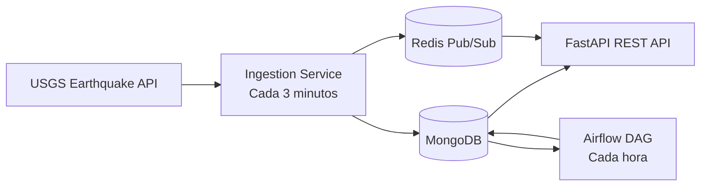

# Earthquake Events Platform

Plataforma desacoplada para consumir eventos sísmicos de USGS, almacenarlos en MongoDB, actualizar métricas horarias y generar reportes con Airflow.

## Arquitectura



## Ejecución

1. Copiar `.env.example` a `.env`.
2. Ajustar `API_PUBLIC_PORT`, `AIRFLOW_PORT` o `MONGO_PUBLIC_PORT` si esos puertos ya están ocupados.
3. Ejecutar `docker compose up --build`.
4. Consultar Swagger en `http://localhost:8000/docs` o en el valor configurado en `API_PUBLIC_PORT`.
5. Consultar Airflow en `http://localhost:8080` o en el valor configurado en `AIRFLOW_PORT`, con las credenciales `AIRFLOW_ADMIN_*`.

`API_HOST` y `API_PORT` controlan la escucha de Uvicorn dentro del contenedor; `API_PUBLIC_PORT` controla el puerto de Windows. La colección de Postman usa su propia variable `base_url`, cuyo valor predeterminado es `http://localhost:8000`; actualízala si cambias `API_PUBLIC_PORT`.

La primera ejecución de Airflow puede tardar mientras crea su base SQLite local e instala las dependencias adicionales del DAG.
Redis se utiliza como canal compartido para entregar eventos a los clientes WebSocket entre contenedores.

## Dependencias y entorno local

El proyecto usa `pyproject.toml` como manifiesto y `uv.lock` para reproducir la resolución exacta de dependencias. `uv` es el gestor recomendado para este repositorio; `requirements.txt` no se mantiene en paralelo.

```bash
uv sync
uv run pytest
uv run python -m compileall -q src ingestion.py airflow tests
```

Para actualizar la resolución después de cambiar dependencias:

```bash
uv lock
uv sync
```

## Endpoints

- `GET /health`: estado de la API y MongoDB.
- `GET /live`: comprueba que el proceso de la API está activo.
- `GET /ready`: comprueba que la API puede conectarse a MongoDB.
- `GET /earthquakes`: eventos con `skip`, `limit`, `min_magnitude`, `start_date`, `end_date`, `sort_by` y `order`.
- `GET /metrics`: métricas por ventana UTC `YYYY-MM-DDTHH`.
- `GET /reports`: reportes horarios persistidos.
- `GET /prometheus`: métricas técnicas de FastAPI.

La ruta `/prometheus` se usa para evitar el conflicto entre el endpoint funcional `/metrics` exigido por la prueba y el endpoint de instrumentación de Prometheus.

## Diseño de datos

`earthquakes` usa `event_id` como índice único. La ingesta usa `replace_one(..., upsert=True)`, por lo que repetir una respuesta de USGS no crea duplicados. Tras insertar o actualizar un evento, se recalculan únicamente sus ventanas UTC mediante una agregación de MongoDB.

`metrics` tiene una fila por ventana horaria y contiene cantidad, promedio, máximo y distribución (`<3`, `3-5`, `5-7`, `>=7`). `hourly_reports` tiene una fila por hora cerrada y conserva las tres ubicaciones más frecuentes, extrayendo el texto posterior a `of`.

## Validación local

```bash
python -m compileall -q src ingestion.py airflow tests
pytest
```

La colección Postman está en `postman/earthquake-api.postman_collection.json`.
